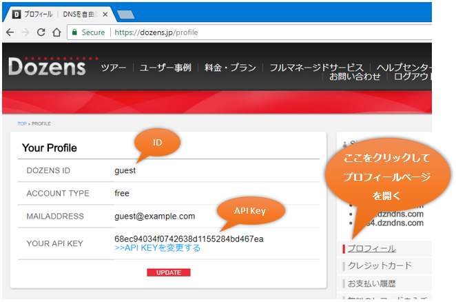

Dozens API Client for .NET (and COM) [](https://www.nuget.org/packages/DozensAPIClient/) [](https://ci.appveyor.com/project/jsakamoto/dozensapiclient-for-dotnet)
==========================

Summary / 概要
--------------
クラウド時代に対応した DNSサービス "Dozens" https://dozens.jp の REST API を呼び出して、
ゾーンやレコードの追加・取得・変更・削除を行うことができる、C# で書かれたクライアントアクセスライブラリです。


C# からはもちろん、F# スクリプトや Windows PowerShell などの .NET Framework を利用可能な処理系から利用可能なほか、
COM サーバーとして登録することで、VBSvript や JScript、VB6 などからも利用することが可能です。

NuGet にもパッケージとして登録済みです。

https://www.nuget.org/packages/DozensAPIClient/

ですので、例えばパッケージマネージャコンソールから以下のコマンドを実行するなどの手順により、
容易に自分のプロジェクトに Dozens API Client を追加することができます。

```powershell
# Package Manager Console
PM> Install-Package DozensAPIClient
```

```bash
# .NET CLI
> dotnet add package DozensAPIClient
```

System Requirements / システム要件
-----------------------------------

- .NET Framework 3.5 以降
- 又は .NET Core 1.1 以降

Notice / 注意
-------------
This class library dose not work at ".NET Framework 3.5 Client Profile".

「.NET Framework 3.5 Client Profile」上では動作しません。

How to get API Key / API キーの入手方法
-------------

It is needed to access Dozens API that Dozens user ID and API key for your Dozens account.  
You can get API key from ["prfile" page](https://dozens.jp/profile) on Dozens controll panel site.

Dozens API にアクセスするには、Dozens ユーザーIDと API キーが必要です。  
API キーは Dozens のコントロールパネルサイトにある ["プロフィール" ページ](https://dozens.jp/profile)から取得できます。



Usage - C# Sample Code / 使い方 - C# サンプルコード
--------------------------------

```csharp
using DozensAPI;
...

// Create Dozens API client object with credential.
// (認証情報とともに Dozens API クライアントオブジェクトを生成)
var dozens = new Dozens("{userId}", "{apiKey}");

// Create zone. (ゾーンを作成)
dozens.CreateZone("example.com");

// Get all zones. (全てのゾーンを取得)
var zones = dozens.GetZones();
foreach (var zone in zones) {
  Console.WriteLine(zone.Name);
}

// Delete zone. (ゾーンの削除)
dozens.DeleteZone("example.com");

// Create DNS record in specified zone.
// (指定したゾーンに DNS レコードを作成)
dozens.CreateRecord("example.net", "www", "A", 0, "192.168.0.101", 7200);

// Get all DNS records in specified zone.
// (指定したゾーンのすべての DNS レコードを取得)
var records = dozens.GetRecords("example.net");
foreach (var record in records) {
  Console.WriteLine($"{record.Name},{record.Type},{record.Prio},{record.Content},{record.TTL}")
}

// Update DNS record. (DNS レコードの更新)
dozens.UpdateRecord("example.net", "www", 0, "192.168.0.102", 7200);

// Delete DNS record. (DNS レコードの削除)
dozens.DeleteRecord("example.net", "www");
```

Usage / 使い方 - YouTube Videos
--------------------------------

### F# Script Edition / F# スクリプト版

http://youtu.be/ziklLtz08og

### C# Console App Edition / C# コンソールアプリ版

http://youtu.be/it_WeNAeeds

### Windows PoerShell Edition / Windows PowerShell 版

http://youtu.be/3EQVmKplISo

### VBScript Edition / VBScript 版

http://youtu.be/DDLL8fpPAa4


### Extra - Microsoft Small Basic

"Dozens API Client for Small Basic" http://dozens4smallbasic.codeplex.com をインストールすると、
Microsoft Small Basic http://smallbasic.com/ からも Dozens の REST API を呼び出して自由に DNS を構成することができます。

http://youtu.be/a5bKMkI0P4M


## ライセンス / License

[Mozilla Public License Version 2.0](LICENSE)